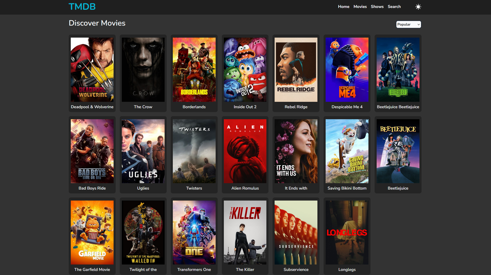

# MovieAppReact 🎬

MovieAppReact is a web application that showcases the latest movies and TV shows, using data from the TMDB (The Movie Database) API. Built with React, Vite, and Tailwind CSS, this app delivers a smooth and responsive user experience with modern front-end tools.

## Features ✨

- **Browse Movies and TV Shows**: Explore popular, top-rated, and upcoming movies or TV shows.
- **Detailed Info**: View detailed information about each movie or TV show, including overview, rating, and trailers.
- **Responsive Design**: Mobile-first approach, optimized for all screen sizes using Tailwind CSS.
- **Lazy Loading**: Images are lazy-loaded for performance optimization.
<!-- - **Framer Motion Animations**: Smooth transitions and animations across the app. -->

## Tech Stack 💻

- **React**: For building user interfaces.
- **Vite**: For fast builds and an optimized development environment.
- **Tailwind CSS**: For utility-first responsive design.
- **Axios**: To fetch data from the TMDB API.
- **React Router**: For handling routing in the app.
<!-- - **Framer Motion**: For smooth animations.
- **React Player**: For rendering movie and TV show trailers.
- **React Circular Progress Bar**: For displaying ratings visually. -->

## Installation 🛠️

To run this project locally, follow these steps:

1. Clone the repository:

```bash
git clone https://github.com/MenasheMtku/movie-app-react.git
```

2. Cd to the directory:

```bash
cd movie-app-react
```

3. Install the dependencies packages:

```bash
npm install
```

4. Create a .env file in the root directory and add your TMDB API key:

```bash
 VITE_TMDB_API_KEY=your_tmdb_api_key
```

5. Run the program in your loaclhost:

```bash
npm run dev
```
