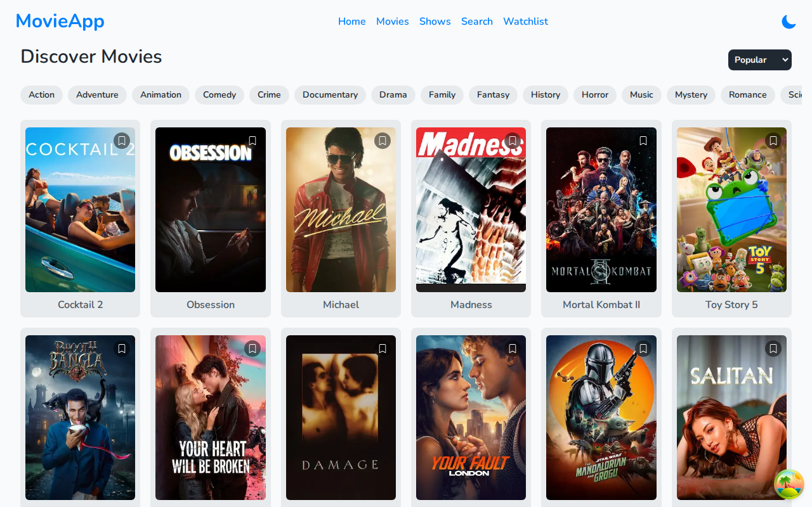

# MovieAppReact

A modern Movie & TV show discovery app built with Next.js 14 (App Router), React 18, and TypeScript. Pulls live data from the [TMDB API](https://www.themoviedb.org/documentation/api) and is hosted on Netlify.



## Features

- **Browse & Discover** — Popular, trending, upcoming movies and TV shows
- **Genre Filtering** — Filter content by genre with a chip-based UI
- **Detail Pages** — Overview, rating, cast, and YouTube trailers per title
- **Watchlist** — Add/remove titles; persisted to `localStorage`
- **Dark / Light Mode** — System-preference aware, toggled and persisted via `localStorage`
- **Page Transitions** — Smooth route animations with Framer Motion
- **Responsive Design** — Mobile-first layout with Tailwind CSS

## Tech Stack

| Layer | Library |
|-------|---------|
| Framework | Next.js 14 (App Router) |
| UI | React 18 + TypeScript |
| Styling | Tailwind CSS |
| Data fetching | TanStack React Query v5 + Axios |
| Animations | Framer Motion |
| Carousels | Swiper |
| Ratings display | React Circular Progress Bar |
| Icons | React Icons |

## Architecture

```
src/
├── app/          # Next.js App Router — layouts, pages, error boundaries, sitemap, robots
├── views/        # Client-side page components (imported by app/*/page.tsx)
├── components/   # Shared UI components (cards, navbar, skeleton, etc.)
├── services/
│   └── api.ts    # All TMDB fetch functions + imagePath / imagePathOriginal constants
├── utils/
│   └── helpers.ts # Pure data-transformation helpers (shortenOverview, minutesToHours, etc.)
├── contexts/
│   ├── themeContext/     # ThemeContext — dark mode, useTheme()
│   └── watchlistContext/ # WatchlistContext — watchlist CRUD, useWatchlist()
├── hooks/        # useInfiniteScroll (IntersectionObserver-based)
└── types/        # Shared TypeScript types (Movie, Program, DetailsType, ApiResponse<T>)
```

**Routes:** `/` · `/movies` · `/shows` · `/search` · `/movie/[id]` · `/tv/[id]` · `/watchlist`

## Setup

```bash
# 1. Clone and install
git clone https://github.com/MenasheMtku/movie-app-react.git
cd movie-app-react
npm install

# 2. Add your TMDB API key
echo "NEXT_PUBLIC_TMDB_API_KEY=your_tmdb_api_key" > .env

# 3. Start the dev server
npm run dev
```

Get a free API key at [themoviedb.org/settings/api](https://www.themoviedb.org/settings/api).

## Scripts

```bash
npm run dev      # Start dev server (localhost:3000)
npm run build    # Production build
npm run start    # Start production server
npm run lint     # ESLint (warnings treated as errors)
```
